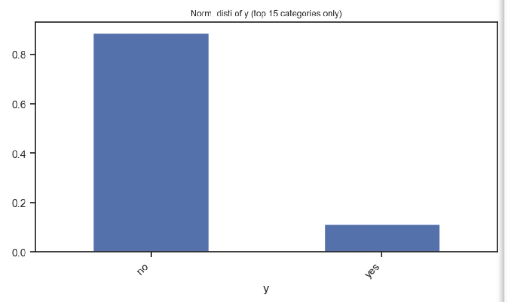
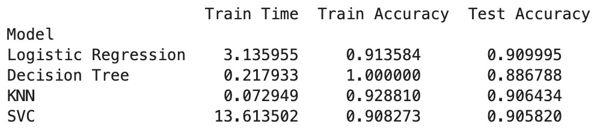
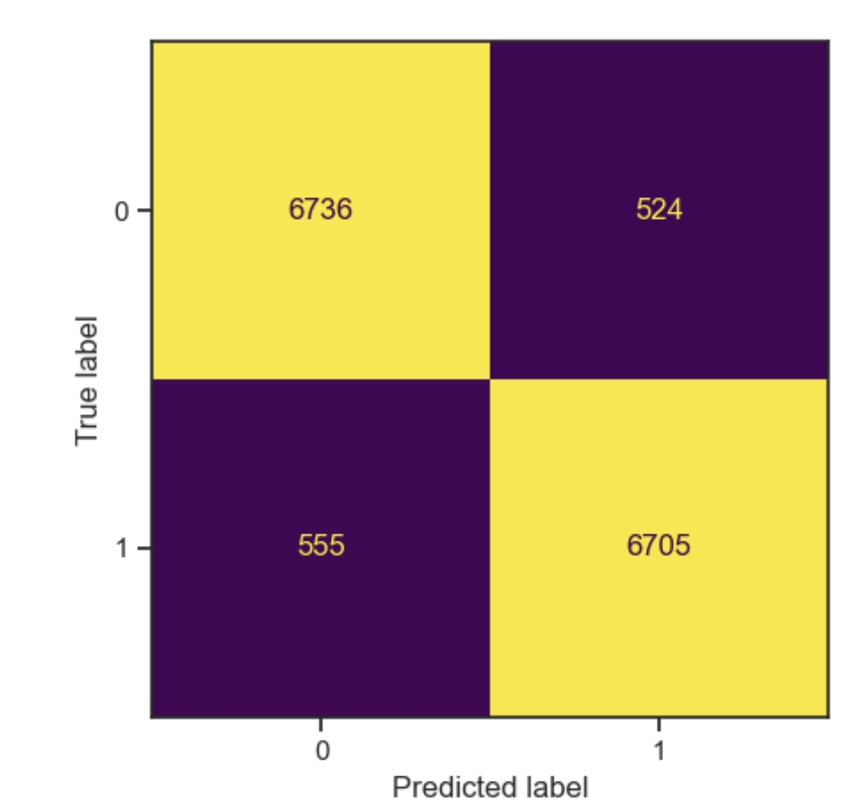
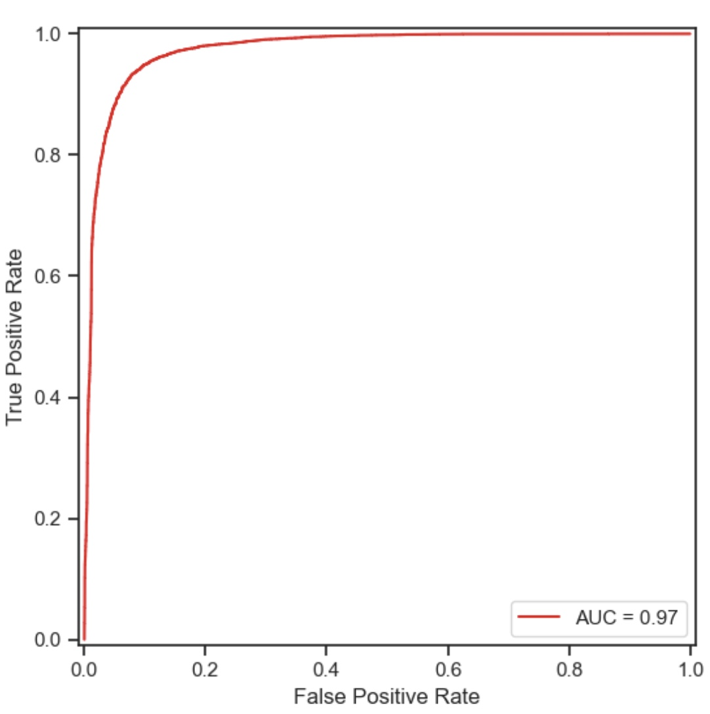
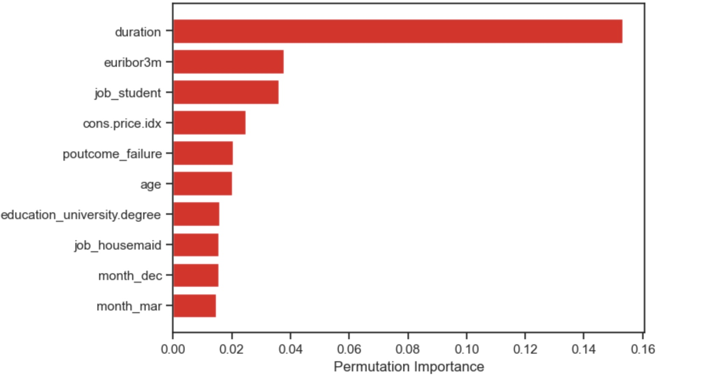

**Business Goal**

Effectiveness of Marketing campaigns are critical for continued success of businesses around the world in the increasingly competitve environment. A rigorous process in understanding the various factors impacting effective campaigns will help improve outcome for future campaigns. This study used to determine factors driving the effectiveness of a marketing campaign based on the data collected from portuguese marketing campaign related to bank deposit subscription

The business goal is to find a model that can explain success of a contact, i.e. if the client subscribes the deposit. This model can increase campaign efficiency by identifying the main characteristics that affect success, helping in a better management of the available resources (e.g. human effort, phone calls, time) and selection of a high quality and affordable set of potential buying customers.

Objective of this study

- Understand the relationship between various features affecting the success of a campaign
- Build and evaluate multiple classficication models to predict success of a contact, i.e. if the client subscribes the deposit.
- Provide actionable insights to improve effectiveness of future marketing campaigns

**Data**

- Data for this analysis was collected by a Portuguese bank that used its own contact-center to do directed marketing campaigns.The telephone, with a human agent as the interlocutor, was the dominant marketing channel

- The dataset collected is related to 17 campaigns that occurred between May 2008 and November 2010, corresponding to a total of 79354 contacts. During these phone campaigns, an attractive long-term deposit application, with good interest rates, was offered. For each contact, a large number of attributes was stored and if there was a success (the target variable). For the whole database considered, there were 6499 successes (8% success rate).

- Shape of Data Set Analysed : (41188, 21)

**Modelling & Performance**

In this project, we employed various classification modeling techniques to predict success of the campaign. The models evaluated include Logistical Regression, K Nearest Neighbor, Decision Tree and Support Vector machine. Each model was trained and evaluated using a train/test split. Initial results of the modelling performance as below - metrics considered include time to train, accuracy on trraining and testing data. Based on the intial modelling, logistical and SVM models seem to give highest accuracy but logistical regression took far less time

Considering the imbalance in the dataset, AUC score was chosen as the performance metric to evaluate the models against. We also performed cross-validation and hyperparameter tuning using GridSearchCV to optimize performance accross each of the models. Overall SVM seems to be the best model : AUC score: 0.938163 using {'svc__gamma': 0.01, 'svc__kernel': 'rbf'} 

Furthermore, we validated if SMOTENC adjusted dataset improves the performance of the model. SVM model with balanced dataset gives the best performance based on the AUC score (0.97)

     -      

**Conclusion**

Based on the model the top 10 features which influence the model performance includes

 

##### Key Reccomendations

Based on the top 10 features identified by the best performing model, below are some reccomendations to improve effectiveness of future marketing campaigns

- Call duration is the most relevant feature to predict the outcome of the campaign
- Interest rates are an important macro factor that impacts performance of campaign
- Students and inviduals with university education have a higher propensity for positive outcome from the campaign
- Participants who have been taregtted in previous campigns have a higher likelyhood of succes
- Month of the campaign have an impact on the success of the campaign - December amd March will have highest chance of success

